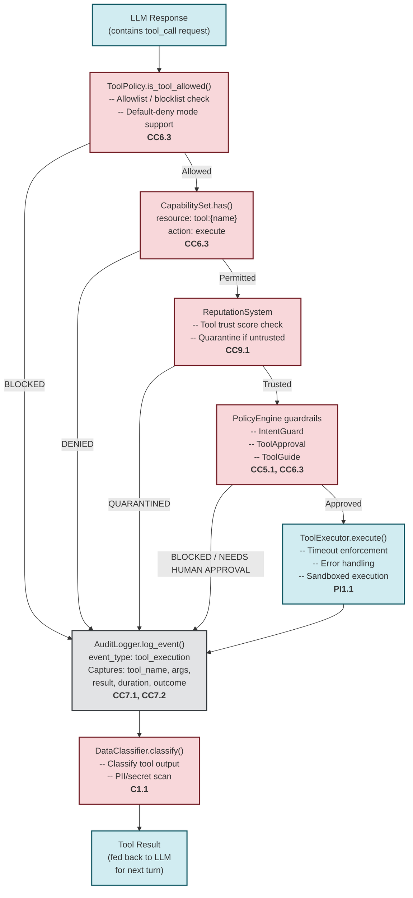
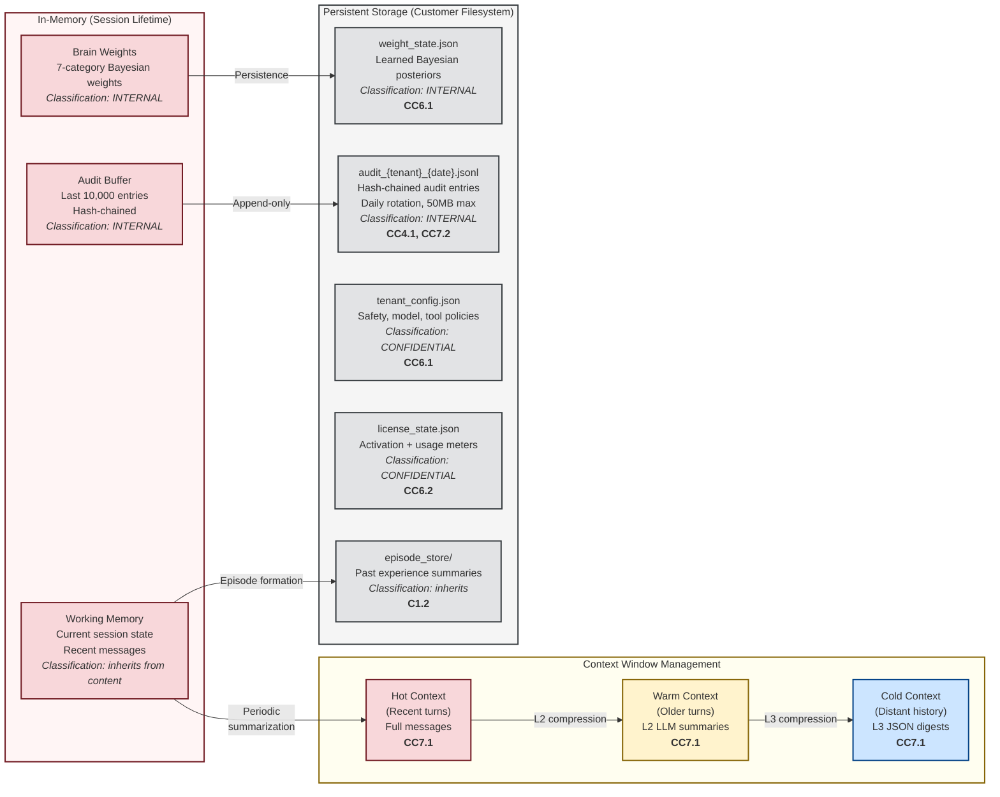
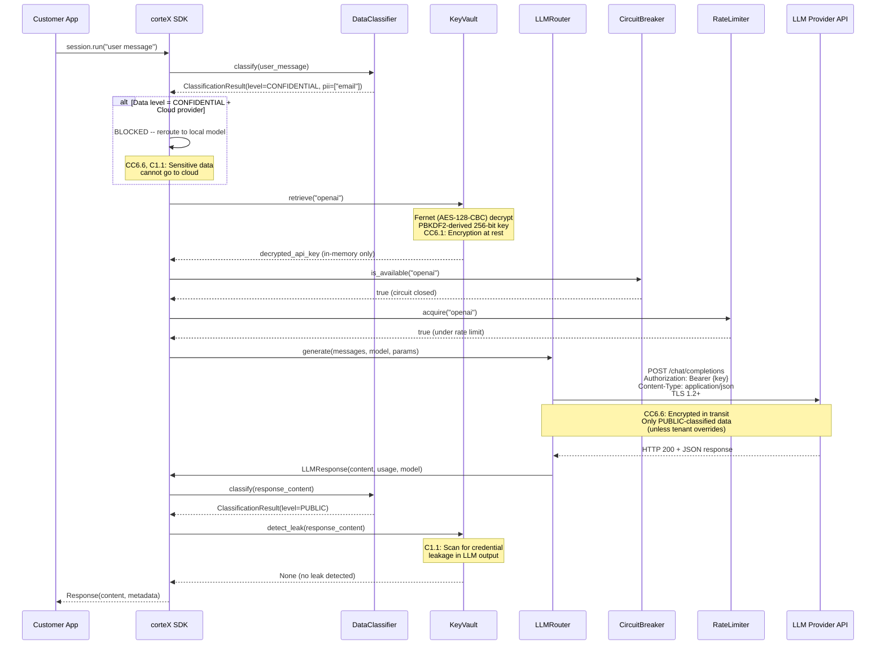
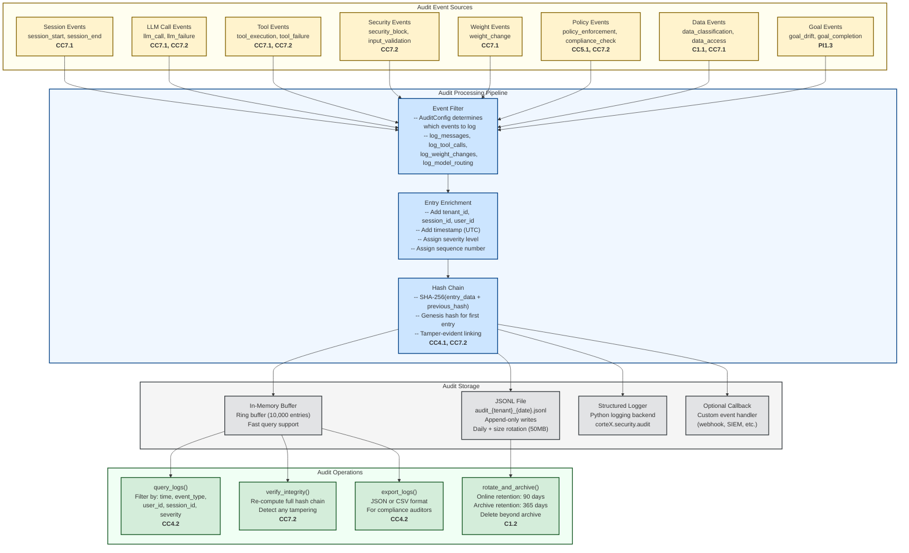
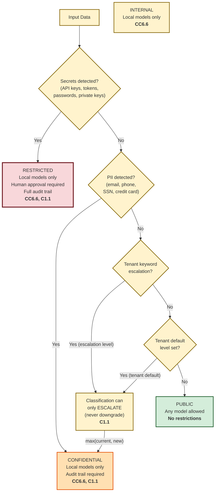

# corteX SDK -- Data Flow Diagram

> **SOC 2 Type 1 -- GAP-S15: Data Flow Diagram**
>
> **Document ID**: DFD-001
> **Version**: 1.0
> **Classification**: CONFIDENTIAL
> **Owner**: Questo Ltd. Engineering
> **Last Updated**: 2026-02-16
> **Review Cycle**: Annual or upon material change

---

## 1. Overview

This document maps every data flow within the corteX SDK, from user input to
final response. Each processing step is annotated with the applicable SOC 2
Common Criteria (CC) reference, data classification checkpoints, PII detection
points, and audit logging triggers.

---

## 2. Primary Request Processing Flow

This diagram traces a single user request through the complete corteX processing
pipeline.

```mermaid
graph TD
    classDef input fill:#FFF3CD,stroke:#856404,color:#333,stroke-width:2px
    classDef safety fill:#F8D7DA,stroke:#721C24,color:#333,stroke-width:2px
    classDef brain fill:#E8D5F5,stroke:#6F42C1,color:#333,stroke-width:2px
    classDef llm fill:#CCE5FF,stroke:#004085,color:#333,stroke-width:2px
    classDef output fill:#D4EDDA,stroke:#155724,color:#333,stroke-width:2px
    classDef audit fill:#E2E3E5,stroke:#383D41,color:#333,stroke-width:2px
    classDef memory fill:#D1ECF1,stroke:#0C5460,color:#333,stroke-width:2px

    START["User Input<br/>(Natural language message)"]:::input

    subgraph PHASE_1 ["Phase 1: Input Validation & Classification"]
        direction TB
        SAFETY_INPUT["SafetyPolicy.check_input()<br/>-- Prompt injection detection (12 patterns)<br/>-- Blocked content patterns<br/>-- Blocked topics<br/><b>CC5.1, CC6.6, PI1.1</b>"]:::safety
        PII_INPUT["DataClassifier.classify()<br/>-- PII detection (email, phone, SSN, CC)<br/>-- Secret detection (7 patterns)<br/>-- Tenant keyword escalation<br/><b>C1.1, CC6.6</b>"]:::safety
        COMPLIANCE_PRE["ComplianceEngine.pre_check()<br/>-- GDPR: consent + data minimization<br/>-- HIPAA: encryption + BAA check<br/>-- SOC2: access controls + logging<br/>-- ISO27001: activity logging<br/><b>CC5.1, CC9.1</b>"]:::safety
        AUDIT_INPUT["AuditLogger.log_event()<br/>event_type: session_start<br/>Captures: user_id, session_id,<br/>classification_level, tenant_id<br/><b>CC4.1, CC7.1, CC7.2</b>"]:::audit
    end

    subgraph PHASE_2 ["Phase 2: Context Assembly & Brain Processing"]
        direction TB
        MEMORY_RETRIEVE["MemoryFabric.get_relevant_context()<br/>-- Working Memory (session state)<br/>-- Episodic Memory (past experiences)<br/>-- Semantic Memory (factual knowledge)<br/><b>PI1.1</b>"]:::memory
        CTX_COMPILE["ContextCompiler.compile()<br/>-- 4-Zone Assembly:<br/>  System (12%) | Persistent (8%)<br/>  Working (40%) | Recent (40%)<br/><b>PI1.1</b>"]:::brain
        GOAL_CHECK["GoalTracker + GoalDNA<br/>-- Goal alignment verification<br/>-- Token fingerprint drift detection<br/>-- Loop detection (4 detectors)<br/><b>PI1.1, PI1.3</b>"]:::brain
        BRAIN_STATE["BrainStateInjector<br/>-- Behavioral weights to prompt<br/>-- Active column context<br/>-- Surprise/prediction context<br/><b>PI1.1</b>"]:::brain
        PARAM_RESOLVE["BrainParameterResolver<br/>-- temperature, top_p, top_k<br/>-- max_tokens, penalties<br/>-- thinking_budget, stop_sequences<br/><b>PI1.1</b>"]:::brain
    end

    subgraph PHASE_3 ["Phase 3: LLM Routing & Inference"]
        direction TB
        CAPS_CHECK["CapabilitySet.has()<br/>-- Permission verification<br/>-- Expired capability check<br/><b>CC6.3</b>"]:::safety
        RISK_CHECK["RiskAttenuator.compute_risk()<br/>-- Tool risk + data level + confidence + drift<br/>-- Capability attenuation if risk > 0.3<br/>-- Human approval required if risk > 0.8<br/><b>CC6.3, CC9.1</b>"]:::safety
        DATA_ENFORCE["DataClassifier.enforce()<br/>-- PUBLIC: any model<br/>-- INTERNAL: local only<br/>-- CONFIDENTIAL: local + audit<br/>-- RESTRICTED: local + approval + audit<br/><b>C1.1, CC6.6</b>"]:::safety
        KEYVAULT_DECRYPT["KeyVault.retrieve()<br/>-- Fernet decryption (AES-128-CBC)<br/>-- PBKDF2-derived 256-bit master key<br/>-- Key held in memory only<br/>-- No env fallback<br/><b>CC6.1, CC6.2</b>"]:::safety
        LLM_ROUTE["LLMRouter.generate()<br/>-- Cognitive classification (zero-LLM)<br/>-- Weight-based model selection<br/>-- Circuit breaker check<br/>-- Rate limiter check<br/>-- Budget enforcement<br/><b>PI1.1, CC9.1</b>"]:::llm
        LLM_CALL["LLM Provider API Call<br/>-- HTTPS/TLS 1.2+<br/>-- Retry with exponential backoff<br/>-- Automatic fallback on failure<br/><b>CC6.6</b>"]:::llm
        COST_RECORD["CostTracker.record_call()<br/>-- Per-tenant cost tracking<br/>-- Session-level budgets<br/><b>CC7.1</b>"]:::audit
        AUDIT_LLM["AuditLogger.log_event()<br/>event_type: llm_call<br/>Captures: provider, model, tokens,<br/>latency, cost, routing_reason<br/><b>CC4.1, CC7.1, CC7.2</b>"]:::audit
    end

    subgraph PHASE_4 ["Phase 4: Response Validation & Output"]
        direction TB
        SAFETY_OUTPUT["SafetyPolicy.check_output()<br/>-- PII detection in output<br/>-- Blocked content patterns<br/>-- Blocked topics<br/><b>CC5.1, PI1.2, C1.1</b>"]:::safety
        LEAK_DETECT["KeyVault.detect_leak()<br/>-- Scan output for API keys<br/>-- Full decrypted key comparison<br/><b>CC6.1, C1.1</b>"]:::safety
        QUALITY_CHECK["PopulationQualityEstimator<br/>-- Ensemble quality scoring<br/>-- Agreement analysis<br/><b>PI1.2</b>"]:::brain
        SURPRISE_CHECK["PredictionEngine<br/>-- Actual vs predicted comparison<br/>-- Bayesian surprise signal<br/><b>PI1.2, PI1.3</b>"]:::brain
    end

    subgraph PHASE_5 ["Phase 5: Learning & Persistence"]
        direction TB
        PLASTICITY["PlasticityManager<br/>-- Hebbian learning (LTP/LTD)<br/>-- Homeostatic regulation<br/>-- Weight consolidation<br/><b>PI1.3</b>"]:::brain
        WEIGHT_UPDATE["WeightEngine update<br/>-- 7 weight categories<br/>-- Bayesian posterior updates<br/><b>PI1.3</b>"]:::brain
        MEMORY_STORE["Memory consolidation<br/>-- Working memory update<br/>-- Episodic memory formation<br/>-- Context summarization (L2/L3)<br/><b>PI1.1</b>"]:::memory
        AUDIT_RESPONSE["AuditLogger.log_event()<br/>event_type: session_response<br/>Captures: response_quality,<br/>goal_alignment, drift_score<br/><b>CC4.1, CC7.1</b>"]:::audit
    end

    RESPONSE["Validated Response<br/>(content + metadata + artifacts)"]:::output

    %% Main flow
    START --> SAFETY_INPUT
    SAFETY_INPUT -->|"Allowed"| PII_INPUT
    SAFETY_INPUT -->|"BLOCKED<br/>(injection detected)"| AUDIT_INPUT
    PII_INPUT --> COMPLIANCE_PRE
    COMPLIANCE_PRE -->|"Allowed"| AUDIT_INPUT
    COMPLIANCE_PRE -->|"BLOCKED<br/>(compliance violation)"| AUDIT_INPUT
    AUDIT_INPUT --> MEMORY_RETRIEVE

    MEMORY_RETRIEVE --> CTX_COMPILE
    CTX_COMPILE --> GOAL_CHECK
    GOAL_CHECK --> BRAIN_STATE
    BRAIN_STATE --> PARAM_RESOLVE

    PARAM_RESOLVE --> CAPS_CHECK
    CAPS_CHECK --> RISK_CHECK
    RISK_CHECK --> DATA_ENFORCE
    DATA_ENFORCE -->|"Classification allows<br/>selected provider"| KEYVAULT_DECRYPT
    DATA_ENFORCE -->|"BLOCKED<br/>(sensitive data,<br/>cloud provider)"| AUDIT_LLM
    KEYVAULT_DECRYPT --> LLM_ROUTE
    LLM_ROUTE --> LLM_CALL
    LLM_CALL --> COST_RECORD
    COST_RECORD --> AUDIT_LLM

    AUDIT_LLM --> SAFETY_OUTPUT
    SAFETY_OUTPUT -->|"Allowed"| LEAK_DETECT
    SAFETY_OUTPUT -->|"BLOCKED<br/>(PII in output)"| AUDIT_RESPONSE
    LEAK_DETECT -->|"No leak"| QUALITY_CHECK
    LEAK_DETECT -->|"LEAK DETECTED<br/>(API key in output)"| AUDIT_RESPONSE
    QUALITY_CHECK --> SURPRISE_CHECK

    SURPRISE_CHECK --> PLASTICITY
    PLASTICITY --> WEIGHT_UPDATE
    WEIGHT_UPDATE --> MEMORY_STORE
    MEMORY_STORE --> AUDIT_RESPONSE
    AUDIT_RESPONSE --> RESPONSE

    style PHASE_1 fill:#FFF5F5,stroke:#721C24,stroke-width:3px
    style PHASE_2 fill:#F5F0FF,stroke:#6F42C1,stroke-width:2px
    style PHASE_3 fill:#F0F7FF,stroke:#004085,stroke-width:2px
    style PHASE_4 fill:#F0FFF4,stroke:#155724,stroke-width:2px
    style PHASE_5 fill:#FAFAFA,stroke:#383D41,stroke-width:2px
```

---

## 3. Tool Execution Data Flow

When the LLM requests a tool call, a secondary data flow is triggered.

---

## 4. Data at Rest -- Memory Architecture

### Data Retention Policy

| Data Type | Default Retention | Configurable | CC Reference |
|-----------|------------------|-------------|-------------|
| Working Memory | Session lifetime | Via `DataRetention` enum | C1.2 |
| Audit Logs (online) | 90 days | `AuditConfig.retention_days` | CC7.2, C1.2 |
| Audit Logs (archive) | 365 days | Configurable | CC7.2, C1.2 |
| Weight State | Indefinite (until overwritten) | `weight_persistence_path` | N/A |
| License State | Indefinite (until deactivation) | `persistence_path` | CC6.2 |
| Episodic Memory | Configurable | Tenant policy | C1.2 |
| Tenant Config | Indefinite (until tenant removal) | Manual | CC6.1 |

---

## 5. Data in Transit -- LLM Provider Communication

---

## 6. Audit Logging Data Flow

---

## 7. Data Classification Decision Tree

---

## 8. PII Detection Points Summary

PII detection occurs at multiple checkpoints in the data flow:

| Checkpoint | Component | Direction | Action on Detection | CC Reference |
|-----------|-----------|-----------|-------------------|-------------|
| **Input validation** | `SafetyPolicy.check_input()` | Inbound | Log warning (does not block input PII by default) | CC5.1, PI1.1 |
| **Data classification** | `DataClassifier.classify()` | Inbound | Escalate to CONFIDENTIAL; restrict to local models | C1.1, CC6.6 |
| **Output validation** | `SafetyPolicy.check_output()` | Outbound | **BLOCK** response delivery; return error | C1.1, PI1.2 |
| **Credential leak scan** | `KeyVault.detect_leak()` | Outbound | **BLOCK** response; log CRITICAL security event | CC6.1, C1.1 |
| **Tool output classification** | `DataClassifier.classify()` | Tool result | Escalate classification for tool outputs | C1.1 |
| **Compliance pre-check** | `ComplianceEngine` (GDPR/HIPAA) | Both | GDPR: data minimization action; HIPAA: encryption + logging required | CC5.1 |

---

## 9. Cross-Reference: CC Criteria to Data Flow Points

| CC Criteria | Description | Data Flow Points |
|------------|-------------|-----------------|
| **CC4.1** | Monitoring activities | AuditLogger (all phases), hash chain integrity |
| **CC4.2** | Evaluation of monitoring | query_logs(), export_logs(), verify_integrity() |
| **CC5.1** | Control activities | SafetyPolicy (Phase 1, 4), ComplianceEngine (Phase 1), PolicyEngine (tool flow) |
| **CC6.1** | Logical access controls | KeyVault encryption, CapabilitySet, TenantContext isolation |
| **CC6.2** | Access authentication | Ed25519 license validation, tenant-derived KeyVault keys |
| **CC6.3** | Access authorization | CapabilitySet.has(), ToolPolicy, ModelPolicy, RiskAttenuator |
| **CC6.6** | System boundary protection | DataClassifier.enforce(), cloud routing blocks, TLS enforcement |
| **CC7.1** | System monitoring | AuditLogger events at all phases, CostTracker |
| **CC7.2** | Security event monitoring | Security block events, hash chain verification, tamper detection |
| **CC8.1** | Change management | (Development flow -- not in request processing) |
| **CC9.1** | Risk mitigation | RiskAttenuator, DriftEngine, LoopDetector, CircuitBreaker |
| **C1.1** | Confidential information identification | DataClassifier (Phases 1, 3, 4), PII detection, secret detection |
| **C1.2** | Confidential information disposal | Audit rotation, KeyVault.destroy(), data retention config |
| **PI1.1** | Processing completeness and accuracy | GoalTracker, input validation, context compilation, memory retrieval |
| **PI1.2** | Processing output accuracy | Output validation, quality estimation, leak detection |
| **PI1.3** | Processing integrity monitoring | DriftEngine, PredictionEngine surprise, AuditLogger integrity verification |

---

*This data flow diagram is maintained under version control alongside the corteX
SDK source code. Changes to data flows that materially affect this document
trigger a review and update as part of the change management process.*
