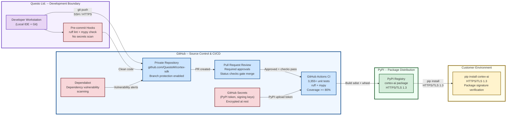
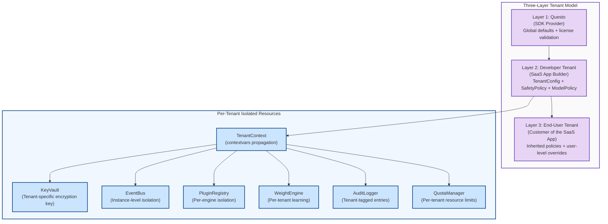

# corteX SDK -- Network Architecture Diagram

> **SOC 2 Type 1 -- GAP-S14: Network Architecture**
>
> **Document ID**: NA-001
> **Version**: 1.0
> **Classification**: CONFIDENTIAL
> **Owner**: Questo Ltd. Engineering
> **Last Updated**: 2026-02-16
> **Review Cycle**: Annual or upon material change

---

## 1. Overview

corteX is a **customer-deployed SDK** -- Questo does not operate production
infrastructure that processes customer data. This document describes two
architectural views:

1. **Development and Distribution Flow** -- How the SDK is developed, tested,
   and delivered to customers.
2. **Customer Deployment Architecture** -- How the SDK operates within a
   customer's environment, including security boundaries and data flows.

---

## 2. Development and Distribution Flow

This diagram shows how code moves from developer workstations through CI/CD to
the customer's `pip install` command.

### Security Controls in Development Flow

| Boundary Transition | Protocol | Control |
|---------------------|----------|---------|
| Developer to GitHub | SSH / HTTPS | Individual SSH keys or personal access tokens; SSO enforced |
| GitHub to CI | Internal | Automated trigger on PR; secrets injected via encrypted store |
| CI to PyPI | HTTPS/TLS 1.3 | Upload via twine with API token from GitHub Secrets |
| PyPI to Customer | HTTPS/TLS 1.3 | pip verifies package hashes; customers can pin versions |

---

## 3. Customer Deployment Architecture

This diagram shows how corteX operates within a customer's infrastructure,
including multi-tenant isolation and LLM provider connectivity.

```mermaid
graph TB
    classDef app fill:#FFF3CD,stroke:#856404,color:#333,stroke-width:2px
    classDef sdk fill:#CCE5FF,stroke:#004085,color:#333,stroke-width:2px
    classDef security fill:#F8D7DA,stroke:#721C24,color:#333,stroke-width:2px
    classDef memory fill:#D4EDDA,stroke:#155724,color:#333,stroke-width:2px
    classDef llm fill:#E8D5F5,stroke:#6F42C1,color:#333,stroke-width:2px
    classDef local fill:#D1ECF1,stroke:#0C5460,color:#333,stroke-width:2px
    classDef storage fill:#E2E3E5,stroke:#383D41,color:#333,stroke-width:2px

    subgraph CUSTOMER_PREMISES ["Customer Premises (On-Prem or Cloud VPC)"]
        direction TB

        subgraph APP_LAYER ["Application Layer"]
            direction LR
            END_USER["End User<br/>(Browser / Mobile / API)"]:::app
            SAAS_APP["Customer SaaS Application<br/>(Django / FastAPI / Flask / etc.)"]:::app
        end

        subgraph SDK_LAYER ["corteX SDK Layer"]
            direction TB
            ENGINE["Engine<br/>Provider management<br/>Agent factory"]:::sdk
            AGENT["Agent<br/>Stateless template"]:::sdk
            SESSION["Session<br/>Stateful runtime<br/>Full brain integration"]:::sdk
            ROUTER["LLMRouter<br/>Circuit breaker<br/>Rate limiter<br/>Cost tracker"]:::sdk
        end

        subgraph SECURITY_LAYER ["Security & Compliance Layer"]
            direction TB
            KEYVAULT["KeyVault<br/>Fernet (AES-128-CBC + HMAC-SHA256)<br/>PBKDF2-derived 256-bit key<br/>600k iterations"]:::security
            SAFETY["SafetyPolicy<br/>Input/output validation<br/>PII detection<br/>Injection protection"]:::security
            DATA_CLASS["DataClassifier<br/>4-level classification<br/>PII + secret detection"]:::security
            COMPLIANCE["ComplianceEngine<br/>GDPR / HIPAA / SOC2 / ISO27001"]:::security
            CAPS["CapabilitySet<br/>Immutable permissions<br/>Risk attenuation"]:::security
            AUDIT["AuditLogger<br/>SHA-256 hash chain<br/>Append-only JSONL"]:::security
        end

        subgraph TENANT_LAYER ["Multi-Tenant Isolation"]
            direction LR
            TENANT_A["Tenant A Context<br/>TenantConfig A<br/>Isolated KeyVault"]:::sdk
            TENANT_B["Tenant B Context<br/>TenantConfig B<br/>Isolated KeyVault"]:::sdk
            TENANT_C["Tenant N Context<br/>TenantConfig N<br/>Isolated KeyVault"]:::sdk
        end

        subgraph MEMORY_LAYER ["Memory & Persistence"]
            direction LR
            WORKING["Working Memory<br/>(Session state)"]:::memory
            EPISODIC["Episodic Memory<br/>(Past experiences)"]:::memory
            SEMANTIC["Semantic Memory<br/>(Factual knowledge)"]:::memory
            WEIGHTS_FILE["Weight Files<br/>(Bayesian state)"]:::storage
            AUDIT_FILES["Audit Logs<br/>(JSONL, hash-chained)"]:::storage
            CONFIG_FILES["Tenant Configs<br/>(JSON)"]:::storage
        end

        subgraph LOCAL_MODELS ["Local Model Infrastructure (Optional)"]
            direction LR
            VLLM["vLLM Server"]:::local
            OLLAMA["Ollama"]:::local
            CUSTOM_MODEL["Custom Model<br/>(OpenAI-compatible API)"]:::local
        end
    end

    subgraph CLOUD_LLM ["Cloud LLM Providers (External)"]
        direction LR
        OPENAI["OpenAI API<br/>GPT-4o, o1, o3<br/>api.openai.com"]:::llm
        GOOGLE["Google Gemini API<br/>Gemini 3 Pro/Flash<br/>generativelanguage.googleapis.com"]:::llm
        ANTHROPIC["Anthropic API<br/>Claude Opus/Sonnet/Haiku<br/>api.anthropic.com"]:::llm
    end

    %% Application flow
    END_USER -->|"User request"| SAAS_APP
    SAAS_APP -->|"Engine() / session.run()"| ENGINE
    ENGINE --> AGENT
    AGENT --> SESSION

    %% SDK internal flow
    SESSION --> ROUTER
    SESSION --> SAFETY
    SESSION --> DATA_CLASS
    SESSION --> COMPLIANCE
    SESSION --> CAPS
    SESSION --> AUDIT

    %% Tenant isolation
    SESSION --> TENANT_A
    SESSION --> TENANT_B
    SESSION --> TENANT_C

    %% Memory
    SESSION --> WORKING
    SESSION --> EPISODIC
    SESSION --> SEMANTIC

    %% Security to Router
    KEYVAULT -->|"Decrypted API keys<br/>(in-memory only)"| ROUTER
    DATA_CLASS -->|"Classification check<br/>before routing"| ROUTER
    COMPLIANCE -->|"Compliance pre-check<br/>before LLM call"| ROUTER

    %% Router to providers
    ROUTER -->|"HTTPS/TLS 1.2+<br/>PUBLIC data only<br/>(unless tenant overrides)"| OPENAI
    ROUTER -->|"HTTPS/TLS 1.2+<br/>PUBLIC data only"| GOOGLE
    ROUTER -->|"HTTPS/TLS 1.2+<br/>PUBLIC data only"| ANTHROPIC
    ROUTER -->|"HTTP(S)<br/>All classification levels"| VLLM
    ROUTER -->|"HTTP(S)<br/>All classification levels"| OLLAMA
    ROUTER -->|"HTTP(S)<br/>All classification levels"| CUSTOM_MODEL

    %% Persistence
    AUDIT -->|"Append-only writes"| AUDIT_FILES
    SESSION -->|"Weight updates"| WEIGHTS_FILE
    TENANT_A -->|"Config persistence"| CONFIG_FILES

    style CUSTOMER_PREMISES fill:#FAFAFA,stroke:#333,stroke-width:4px
    style CLOUD_LLM fill:#F5F0FF,stroke:#6F42C1,stroke-width:3px,stroke-dasharray:8
    style APP_LAYER fill:#FFFEF0,stroke:#856404,stroke-width:2px
    style SDK_LAYER fill:#F0F7FF,stroke:#004085,stroke-width:2px
    style SECURITY_LAYER fill:#FFF5F5,stroke:#721C24,stroke-width:2px
    style TENANT_LAYER fill:#F0F7FF,stroke:#004085,stroke-width:2px
    style MEMORY_LAYER fill:#F0FFF4,stroke:#155724,stroke-width:2px
    style LOCAL_MODELS fill:#F0FAFA,stroke:#0C5460,stroke-width:2px
```

---

## 4. Security Boundary Details

### 4.1 Customer Premises Boundary

All corteX SDK components execute within the customer's own infrastructure. This
is the primary security boundary. Questo has **zero access** to customer
deployments.

| Control | Description |
|---------|-------------|
| **Process isolation** | SDK runs within the customer's Python process |
| **Tenant isolation** | `TenantContext` via `contextvars` ensures per-tenant state separation |
| **KeyVault per tenant** | Each tenant's API keys encrypted with tenant-specific derived key |
| **PluginRegistry per engine** | Each `Engine` instance has an isolated plugin registry |
| **EventBus per instance** | Instance-level pub/sub prevents cross-tenant event leakage |

### 4.2 Cloud LLM Provider Boundary (Dashed Line)

Communication with cloud LLM providers crosses the customer premises boundary.
This is the highest-risk boundary transition.

| Control | Description |
|---------|-------------|
| **Data classification enforcement** | `DataClassifier` blocks INTERNAL/CONFIDENTIAL/RESTRICTED data from cloud providers |
| **TLS encryption** | All provider SDKs enforce HTTPS/TLS 1.2+ minimum |
| **API key protection** | Keys decrypted from `KeyVault` only at point of use; never logged or persisted |
| **Credential leak detection** | `KeyVault.detect_leak()` scans responses for accidentally exposed API keys |
| **Circuit breaker** | Automatic failover after 3 consecutive failures per provider |
| **Rate limiting** | Proactive rate limit management with alternative provider fallback |
| **Cost enforcement** | Per-session and per-tenant budget limits with hard and soft thresholds |

### 4.3 Local Model Boundary

Communication with local/on-prem models stays entirely within the customer
premises boundary.

| Control | Description |
|---------|-------------|
| **All data levels permitted** | LOCAL provider type allows all classification levels including RESTRICTED |
| **Same validation pipeline** | Input/output validation, PII detection, and compliance checks still apply |
| **Configurable transport** | Customer controls HTTP vs HTTPS for local model communication |

---

## 5. Encryption Summary

| Location | Encryption Standard | Key Management |
|----------|-------------------|----------------|
| **API keys in memory** | Fernet (AES-128-CBC + HMAC-SHA256) | PBKDF2-HMAC-SHA256 derivation of 256-bit master key from tenant_id (600,000 iterations) |
| **Data in transit to LLM providers** | TLS 1.2+ (provider SDK enforced) | Provider-managed certificates |
| **Data in transit to PyPI** | TLS 1.3 | PyPI-managed certificates |
| **License keys** | Ed25519 digital signatures | Questo-held private key; embedded public key for verification |
| **Audit log integrity** | SHA-256 hash chains | Genesis hash + sequential chaining |
| **Source code in transit** | SSH / HTTPS to GitHub | Developer SSH keys or PATs |

---

## 6. Network Ports and Protocols

| Source | Destination | Port | Protocol | Purpose |
|--------|------------|------|----------|---------|
| Customer App | corteX SDK | In-process | Python function calls | SDK integration |
| corteX SDK | OpenAI API | 443 | HTTPS/TLS 1.2+ | LLM inference |
| corteX SDK | Google Gemini API | 443 | HTTPS/TLS 1.2+ | LLM inference |
| corteX SDK | Anthropic API | 443 | HTTPS/TLS 1.2+ | LLM inference |
| corteX SDK | Local models | Configurable (typically 8000, 11434) | HTTP or HTTPS | LLM inference |
| Developer | GitHub | 22 / 443 | SSH / HTTPS | Source control |
| GitHub Actions | PyPI | 443 | HTTPS/TLS 1.3 | Package upload |
| Customer | PyPI | 443 | HTTPS/TLS 1.3 | Package download |

---

## 7. Multi-Tenant Isolation Architecture

---

*This network architecture document is maintained under version control alongside
the corteX SDK source code. Changes to the architecture that materially affect
this document trigger a review and update as part of the change management process.*
